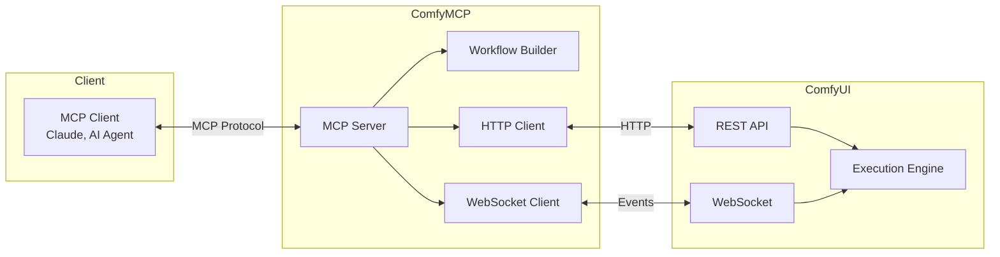

# ComfyMCP

MCP (Model Context Protocol) server for ComfyUI workflow automation. Build, validate, and execute Stable Diffusion workflows programmatically with type-safe node connections.

## Key Features

- **Named Output Connections** - Reference node outputs by name (`checkpoint.CLIP`, `sampler.LATENT`) instead of magic slot indices
- **Type-Safe Validation** - Catch connection errors before submission with comprehensive workflow validation
- **Pre-built Templates** - Ready-to-use templates for text2img and img2img workflows
- **Full MCP Integration** - Complete tool and resource support for AI agents and automation
- **Real-time Execution Tracking** - Monitor workflow progress via WebSocket events
- **Asset Management** - Upload images, list models, and retrieve generated outputs

## Architecture



## Installation

### For Claude Desktop / Claude Code

The easiest way to use ComfyMCP is with `uvx` (comes with [uv](https://docs.astral.sh/uv/)):

```bash
# Install uv if you don't have it
curl -LsSf https://astral.sh/uv/install.sh | sh
```

Add to your Claude Desktop config (`~/.config/claude/claude_desktop_config.json` on Linux, `~/Library/Application Support/Claude/claude_desktop_config.json` on macOS):

```json
{
  "mcpServers": {
    "comfyui": {
      "command": "uvx",
      "args": ["--from", "git+https://github.com/comfymcp/comfymcp", "comfymcp"],
      "env": {
        "COMFYUI_HOST": "127.0.0.1",
        "COMFYUI_PORT": "8188"
      }
    }
  }
}
```

### From Source

```bash
git clone https://github.com/comfymcp/comfymcp.git
cd comfymcp
pip install -e .
```

> **Note:** This package is not yet published to PyPI.

## Quick Start

### As a Standalone Server

```bash
# Start with default settings (ComfyUI at localhost:8188)
comfymcp

# Specify custom host and port
comfymcp --host 192.168.1.100 --port 8188

# Or use environment variables
COMFYUI_HOST=192.168.1.100 COMFYUI_PORT=8188 comfymcp

# With API key authentication
comfymcp --api-key your-api-key

# Enable debug logging
comfymcp --debug
```

### Alternative MCP Configurations

**With pip-installed package:**
```json
{
  "mcpServers": {
    "comfyui": {
      "command": "comfymcp",
      "args": ["--host", "127.0.0.1", "--port", "8188"]
    }
  }
}
```

**With Python path (for development):**
```json
{
  "mcpServers": {
    "comfyui": {
      "command": "python",
      "args": ["-m", "comfymcp.server"],
      "cwd": "/path/to/comfymcp",
      "env": {
        "COMFYUI_HOST": "127.0.0.1",
        "COMFYUI_PORT": "8188"
      }
    }
  }
}
```

### Programmatic Workflow Building

```python
from comfymcp.workflow import WorkflowBuilder

builder = WorkflowBuilder()

# Load checkpoint - returns NodeRef with named outputs
checkpoint = builder.add_node("CheckpointLoaderSimple",
    ckpt_name="v1-5-pruned.safetensors"
)

# Create empty latent
empty_latent = builder.add_node("EmptyLatentImage",
    width=512, height=512, batch_size=1
)

# Encode prompts - use checkpoint.CLIP for named connection
positive = builder.add_node("CLIPTextEncode",
    clip=checkpoint.CLIP,
    text="a majestic mountain landscape at sunset"
)

negative = builder.add_node("CLIPTextEncode",
    clip=checkpoint.CLIP,
    text="ugly, blurry, low quality"
)

# Sample - connect using named outputs
sampler = builder.add_node("KSampler",
    model=checkpoint.MODEL,
    positive=positive.CONDITIONING,
    negative=negative.CONDITIONING,
    latent_image=empty_latent.LATENT,
    seed=42,
    steps=20,
    cfg=7.5,
    sampler_name="euler",
    scheduler="normal",
    denoise=1.0
)

# Decode and save
decode = builder.add_node("VAEDecode",
    samples=sampler.LATENT,
    vae=checkpoint.VAE
)

save = builder.add_node("SaveImage",
    images=decode.IMAGE,
    filename_prefix="output"
)

# Build the workflow
workflow = builder.build()

# Validate before submission
result = builder.validate()
if result.valid:
    print("Workflow is ready to execute")
else:
    for error in result.errors:
        print(f"Error: {error}")
```

## MCP Tools Reference

### Workflow Tools

| Tool | Description | Parameters |
|------|-------------|------------|
| `queue_prompt` | Submit a workflow for execution | `workflow`: dict, `client_id`: optional str |
| `get_queue_status` | Get current queue state | - |
| `get_history` | Get execution history | `prompt_id`: optional str, `max_items`: optional int |
| `get_job_status` | Check status of a specific job | `prompt_id`: str |
| `clear_queue` | Clear all pending queue items | - |
| `delete_queue_item` | Remove specific item from queue | `prompt_id`: str |
| `interrupt_execution` | Stop currently executing workflow | - |

### Builder Tools

| Tool | Description | Parameters |
|------|-------------|------------|
| `list_nodes` | Search available ComfyUI nodes | `category`: optional str, `search`: optional str |
| `get_node_info` | Get detailed node specification | `class_type`: str |
| `refresh_nodes` | Refresh node definition cache | - |
| `create_workflow` | Create a new workflow session | - |
| `add_node` | Add a node to workflow session | `session_id`: str, `class_type`: str, `inputs`: optional dict |
| `build_workflow` | Build and validate workflow | `session_id`: str |
| `validate_workflow` | Validate a raw workflow dict | `workflow`: dict |

### Asset Tools

| Tool | Description | Parameters |
|------|-------------|------------|
| `list_models` | List available models | `model_type`: optional str (checkpoints, loras, vae, etc.) |
| `list_output_images` | List generated images | `subfolder`: optional str |
| `get_image` | Retrieve an image | `filename`: str, `subfolder`: str, `folder_type`: str, `format`: url\|base64 |
| `upload_image` | Upload an image | `image_data`: base64 str, `filename`: str, `folder_type`: input\|temp |
| `list_embeddings` | List available embeddings | - |

### System Tools

| Tool | Description | Parameters |
|------|-------------|------------|
| `get_system_stats` | Get GPU and memory information | - |
| `free_memory` | Free memory/unload models | `unload_models`: bool, `free_memory`: bool |
| `get_extensions` | List loaded extensions | - |
| `check_connection` | Verify ComfyUI is reachable | - |

## MCP Resources Reference

| URI Pattern | Description | MIME Type |
|-------------|-------------|-----------|
| `comfyui://nodes` | List all available nodes | application/json |
| `comfyui://nodes/categories` | List node categories | application/json |
| `comfyui://nodes/category/{name}` | Nodes in a category | application/json |
| `comfyui://nodes/{class_type}` | Specific node definition | application/json |
| `comfyui://outputs` | Recent execution outputs | application/json |
| `comfyui://outputs/{prompt_id}` | Outputs from specific execution | application/json |
| `comfyui://images/{filename}?type=output` | Specific image | image/* |

## Programmatic API

### WorkflowBuilder

The `WorkflowBuilder` class provides a fluent API for constructing workflows:

```python
from comfymcp.workflow import WorkflowBuilder, NodeDefCache

# With node cache for validation (recommended)
cache = NodeDefCache()
# await cache.refresh(client)  # Load from ComfyUI server

builder = WorkflowBuilder(cache=cache)

# Add nodes with automatic ID generation
node = builder.add_node("NodeClass", **inputs)

# Or specify custom ID
node = builder.add_node("NodeClass", node_id="my_id", **inputs)

# Access nodes
node = builder.get_node("my_id")

# Update inputs
builder.update_input("node_id", "input_name", new_value)

# Set seed on sampler nodes
builder.set_seed(seed=12345)  # All samplers
builder.set_seed(node_id="3", seed=12345)  # Specific node

# Build and validate
workflow = builder.build()
result = builder.validate()
```

### NodeRef - Named Output Access

`NodeRef` eliminates magic slot indices by providing named output access:

```python
# Instead of remembering slot indices:
# checkpoint outputs: [MODEL, CLIP, VAE] = slots [0, 1, 2]
sampler_inputs = {
    "model": ["1", 0],     # Error-prone!
    "positive": ["2", 0],
}

# Use NodeRef named properties:
checkpoint = builder.add_node("CheckpointLoaderSimple", ckpt_name="model.safetensors")

# Access outputs by name - much clearer!
checkpoint.MODEL        # Returns ["1", 0]
checkpoint.CLIP         # Returns ["1", 1]
checkpoint.VAE          # Returns ["1", 2]

# Or use the output() method
checkpoint.output("MODEL")

# Common output shortcuts available:
# .MODEL, .CLIP, .VAE, .IMAGE, .LATENT, .CONDITIONING, .MASK, .CONTROL_NET, .AUDIO
```

### Validation

Validate workflows before submission:

```python
from comfymcp.workflow import validate_workflow

result = validate_workflow(workflow, cache=node_cache)

if not result.valid:
    for error in result.errors:
        print(f"[{error.node_id}] {error.error_type}: {error.message}")

for warning in result.warnings:
    print(f"Warning: {warning.message}")
```

Validation checks:
- Required inputs are provided
- Input types match expected types
- Connections reference valid nodes and slots
- Connection types are compatible
- Numeric values are within allowed ranges
- Workflow has at least one output node

## Templates

### Text-to-Image

```python
from comfymcp.templates import Text2ImgTemplate

template = Text2ImgTemplate(
    checkpoint="v1-5-pruned.safetensors",
    positive_prompt="a beautiful landscape, masterpiece, high quality",
    negative_prompt="ugly, blurry, low quality",
    width=512,
    height=512,
    steps=20,
    cfg=7.0,
    sampler_name="euler",
    scheduler="normal",
    seed=-1,  # -1 for random
    batch_size=1,
    filename_prefix="txt2img"
)

# Validate parameters
errors = template.validate_params()
if not errors:
    workflow = template.build()
```

### Image-to-Image

```python
from comfymcp.templates import Img2ImgTemplate

template = Img2ImgTemplate(
    checkpoint="v1-5-pruned.safetensors",
    image="input.png",  # Must exist in ComfyUI input folder
    positive_prompt="enhance the details, add vibrant colors",
    negative_prompt="ugly, blurry",
    denoise=0.75,  # 0.0-1.0, higher = more change
    steps=20,
    cfg=7.0,
    sampler_name="euler",
    scheduler="normal",
    seed=-1,
    filename_prefix="img2img"
)

workflow = template.build()
```

## WebSocket Execution Tracking

Monitor workflow execution in real-time:

```python
from comfymcp.client import ComfyUIClient, ComfyUIWebSocket

async def run_with_progress():
    async with ComfyUIClient() as client:
        # Queue the workflow
        response = await client.queue_prompt(workflow)
        prompt_id = response.prompt_id

        # Track execution via WebSocket
        async with ComfyUIWebSocket() as ws:
            async with ws.track_execution(
                prompt_id,
                on_progress=lambda p: print(f"Progress: {p.percentage:.1f}%"),
                on_node_start=lambda n: print(f"Executing: {n}"),
                on_node_complete=lambda n, o: print(f"Completed: {n}")
            ) as tracker:
                success = await tracker.wait(timeout=300)

                if success:
                    print("Outputs:", tracker.outputs)
                else:
                    print("Error:", tracker.error)
```

## Use Cases

### AI Agent Image Generation

Enable AI assistants to generate images based on user requests:

```python
# AI agent can use MCP tools to:
# 1. List available checkpoints
models = await mcp.call_tool("list_models", {"model_type": "checkpoints"})

# 2. Create and build a workflow
session = await mcp.call_tool("create_workflow")
await mcp.call_tool("add_node", {
    "session_id": session["session_id"],
    "class_type": "CheckpointLoaderSimple",
    "inputs": {"ckpt_name": "dreamshaper_8.safetensors"}
})
# ... add more nodes ...

# 3. Queue and monitor
result = await mcp.call_tool("queue_prompt", {"workflow": workflow})
status = await mcp.call_tool("get_job_status", {"prompt_id": result["prompt_id"]})
```

### Batch Processing Pipeline

Process multiple images with consistent settings:

```python
from comfymcp.templates import Img2ImgTemplate
from comfymcp.client import ComfyUIClient

async def batch_process(input_images: list[str], prompt: str):
    async with ComfyUIClient() as client:
        for image in input_images:
            template = Img2ImgTemplate(
                checkpoint="sd_xl_base.safetensors",
                image=image,
                positive_prompt=prompt,
                denoise=0.6,
            )

            workflow = template.build()
            response = await client.queue_prompt(workflow)

            # Wait for completion
            history = await client.get_history(prompt_id=response.prompt_id)
            # Process results...
```

### Integration with Chat Interfaces

```python
# Use ComfyMCP with any MCP-compatible chat interface
# The AI can naturally discuss and generate images:

# User: "Generate a cyberpunk city at night with neon lights"
# AI uses: list_nodes, create_workflow, add_node, queue_prompt
# AI responds: "I've generated your cyberpunk city. Here's the result..."
```

### Automated Model Testing

```python
async def test_checkpoints():
    """Test all checkpoints with the same prompt."""
    async with ComfyUIClient() as client:
        checkpoints = await client.get_models("checkpoints")

        for ckpt in checkpoints:
            template = Text2ImgTemplate(
                checkpoint=ckpt,
                positive_prompt="a test image, high quality",
                seed=42,  # Fixed seed for comparison
            )

            workflow = template.build()
            await client.queue_prompt(workflow)
```

## Configuration

### Environment Variables

| Variable | Description | Default |
|----------|-------------|---------|
| `COMFYUI_HOST` | ComfyUI server host | 127.0.0.1 |
| `COMFYUI_PORT` | ComfyUI server port | 8188 |
| `COMFYUI_API_KEY` | API key for authentication | None |

### CLI Arguments

```
comfymcp [OPTIONS]

Options:
  --host TEXT          ComfyUI server host [default: 127.0.0.1]
  --port INTEGER       ComfyUI server port [default: 8188]
  --api-key TEXT       ComfyUI API key (if required)
  --no-auto-refresh    Don't refresh node definitions on startup
  --debug              Enable debug logging
```

## Roadmap

Planned features and improvements:

- [ ] **Custom Node Discovery** - Automatic validation for custom nodes
- [ ] **LoRA Integration Helpers** - Simplified LoRA loading and stacking
- [ ] **ControlNet Template** - Pre-built ControlNet workflow template
- [ ] **Inpainting Template** - Pre-built inpainting workflow template
- [ ] **Better Type Mismatch Errors** - More descriptive error messages
- [ ] **WebSocket Progress Streaming** - Stream progress events to MCP clients
- [ ] **Multi-GPU Distribution** - Workflow distribution across multiple GPUs
- [ ] **Workflow Caching** - Cache and reuse common workflow patterns
- [ ] **SDXL-specific Templates** - Optimized templates for SDXL models

## Requirements

- Python 3.10+
- ComfyUI server running and accessible
- MCP-compatible client (for MCP features)

## License

MIT License - see [LICENSE](LICENSE) for details.
